# My Water Site Misc

[3D Files](3D_models/README.md)

# PCB

### [V3.2](https://github.com/Mr-HaleYa/MyWater_Misc/tree/master/PCB#v32)

Front             |  Back
:-------------------------:|:-------------------------:
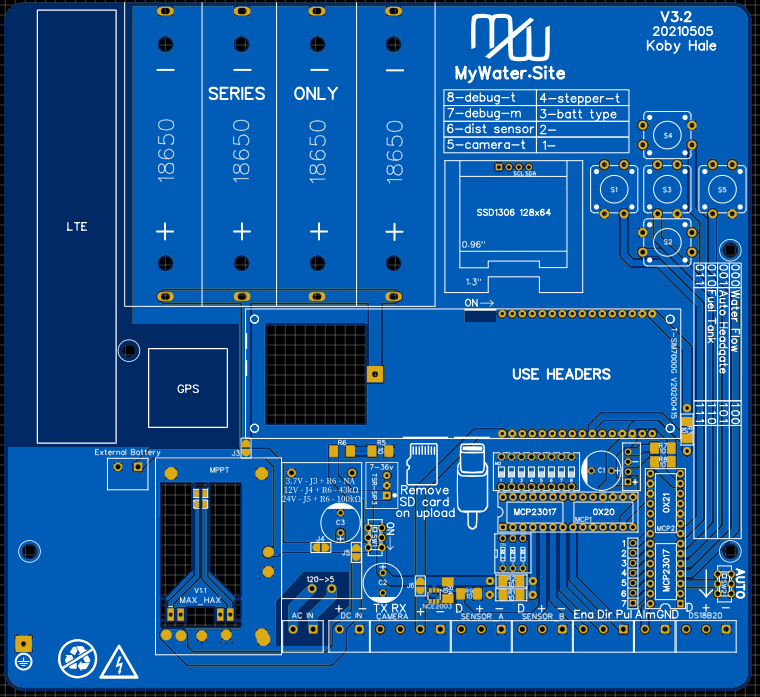  |  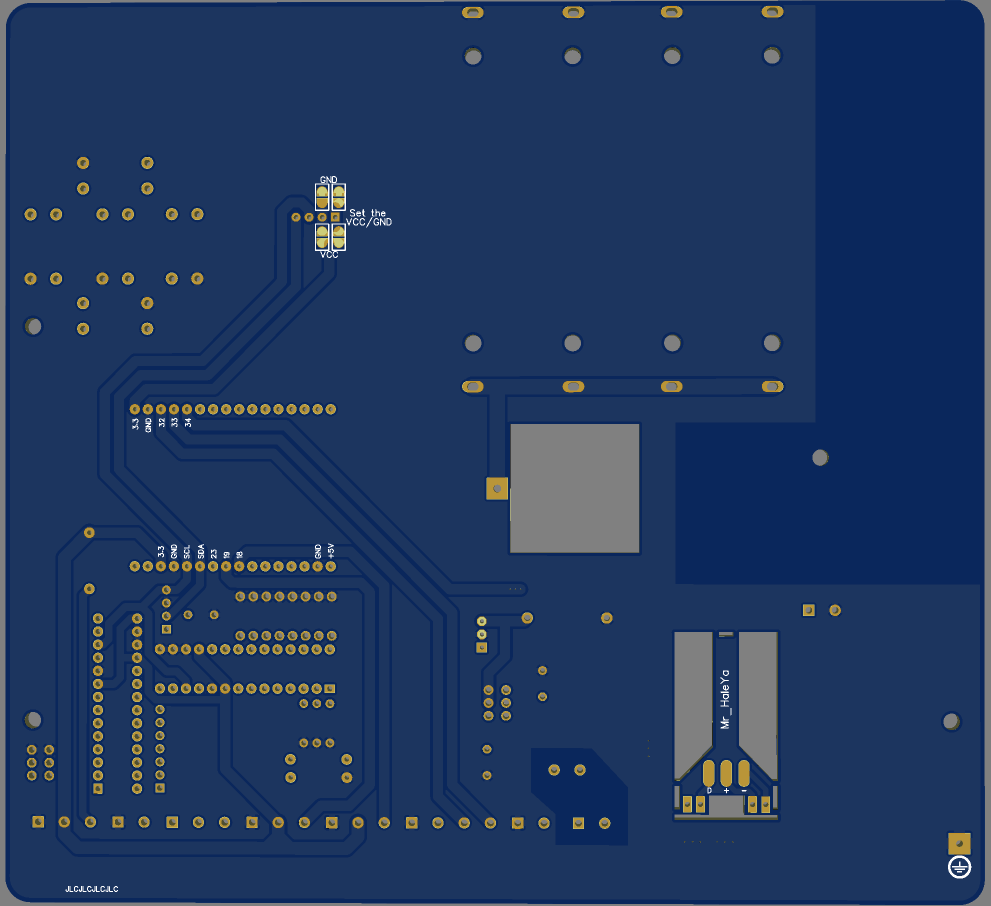

### [V3.1](https://github.com/Mr-HaleYa/MyWater_Misc/tree/master/PCB#v31)

Front             |  Back
:-------------------------:|:-------------------------:
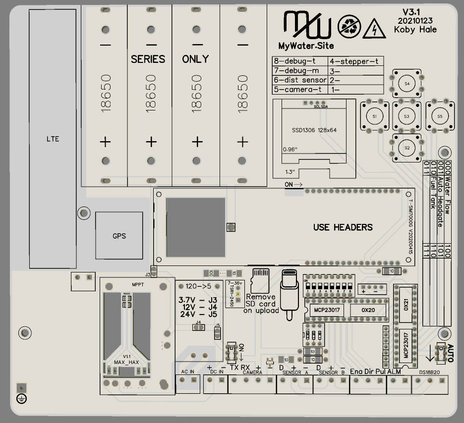  |  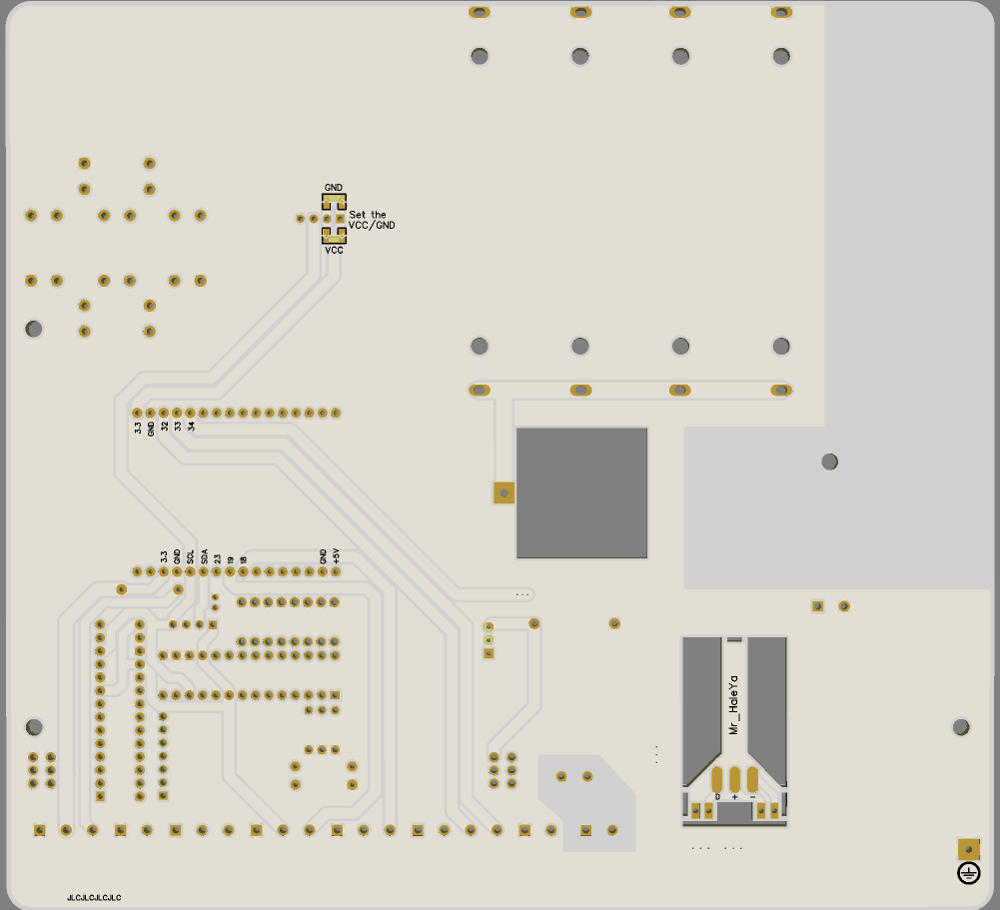

### [V3.0](https://github.com/Mr-HaleYa/MyWater_Misc/tree/master/PCB#v30)

Front             |  Back
:-------------------------:|:-------------------------:
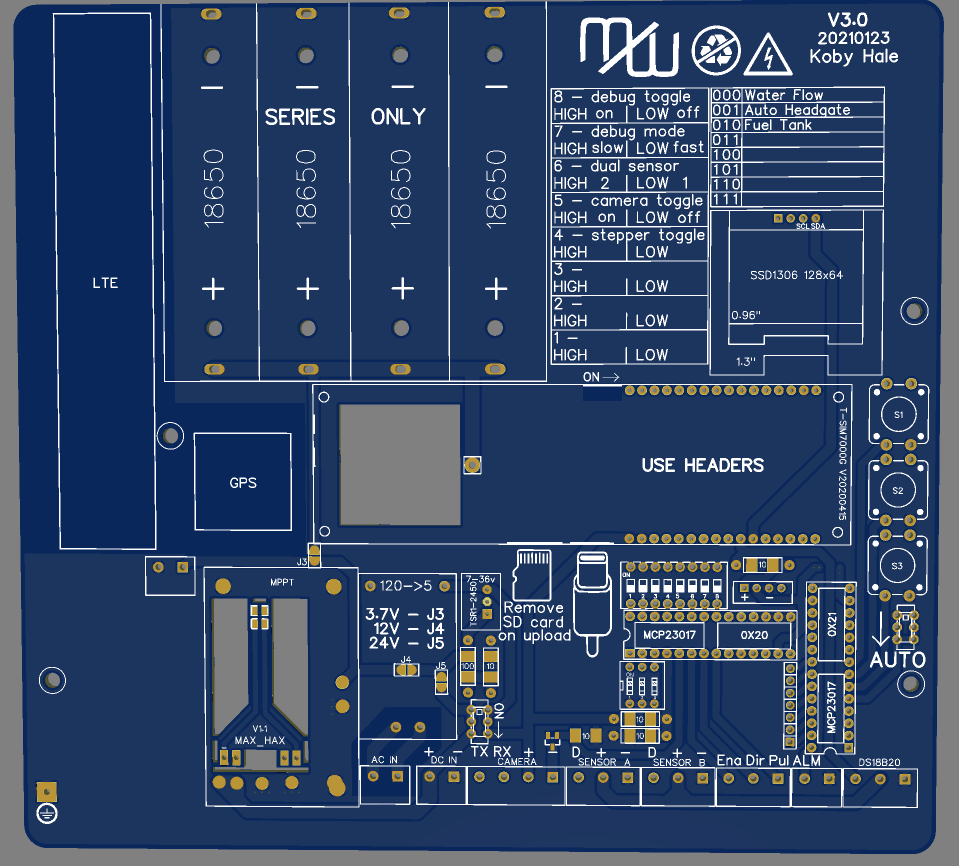  |  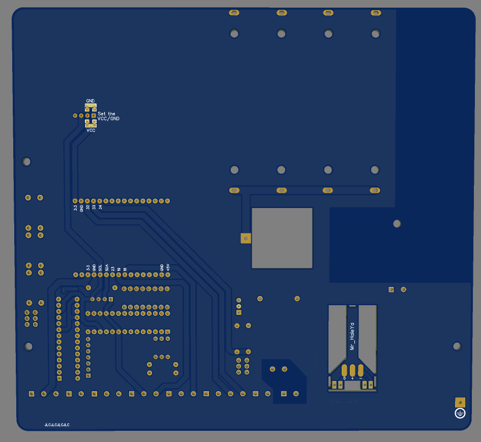

### [V2.0](https://github.com/Mr-HaleYa/MyWater_Misc/tree/master/PCB#v20)

Front             |  Back
:-------------------------:|:-------------------------:
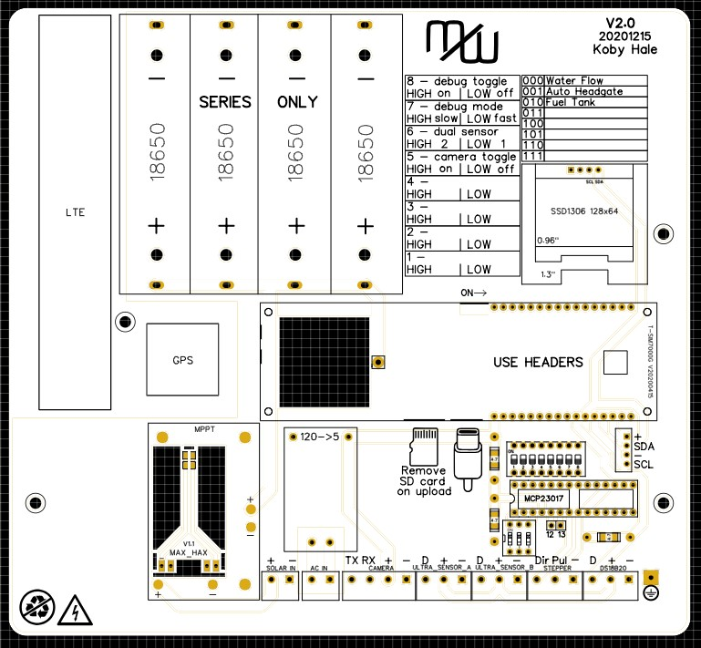  |  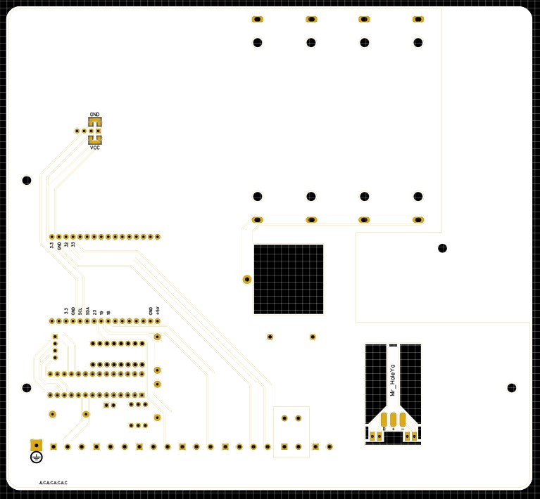

### [V1.2](https://github.com/Mr-HaleYa/MyWater_Misc/tree/master/PCB#v12)

Front             |  Back
:-------------------------:|:-------------------------:
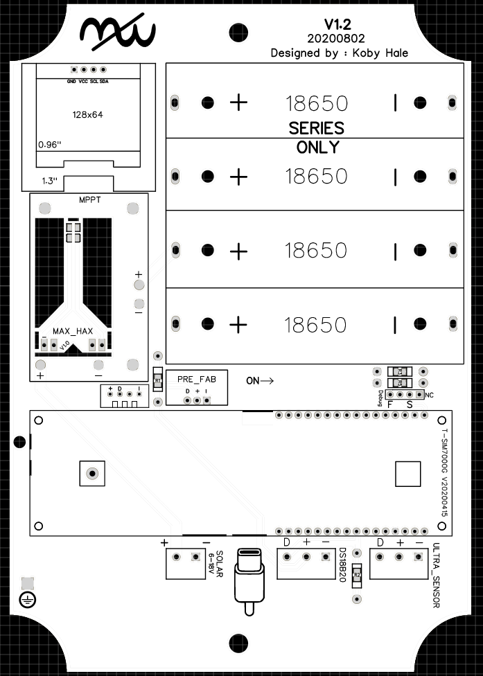  |  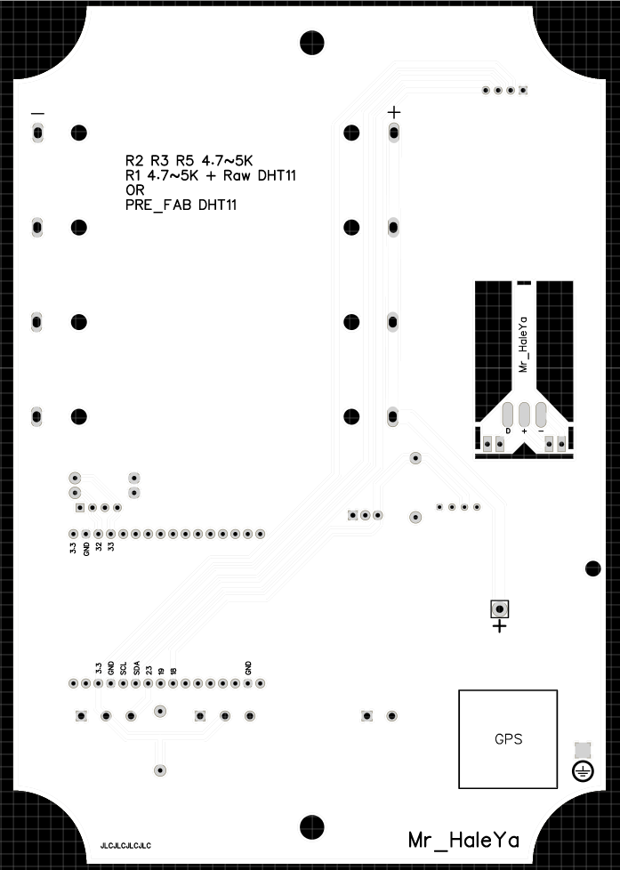

### [V1.1](https://github.com/Mr-HaleYa/MyWater_Misc/tree/master/PCB#v11)

Front             |  Back
:-------------------------:|:-------------------------:
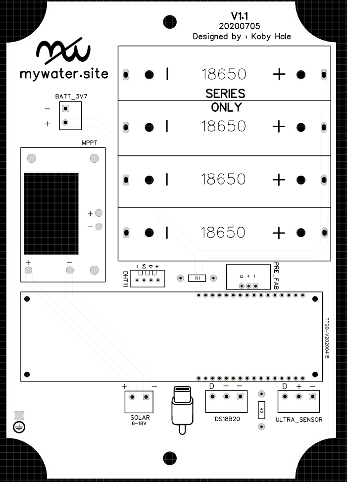  |  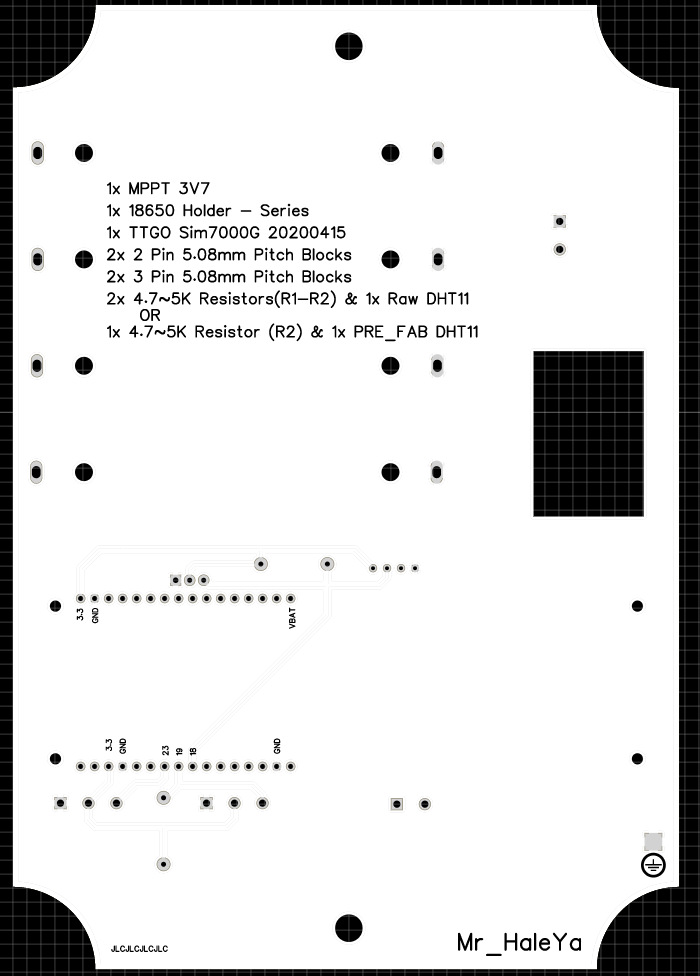

### [V1.0](https://github.com/Mr-HaleYa/MyWater_Misc/tree/master/PCB#v10)

Front             |  Back
:-------------------------:|:-------------------------:
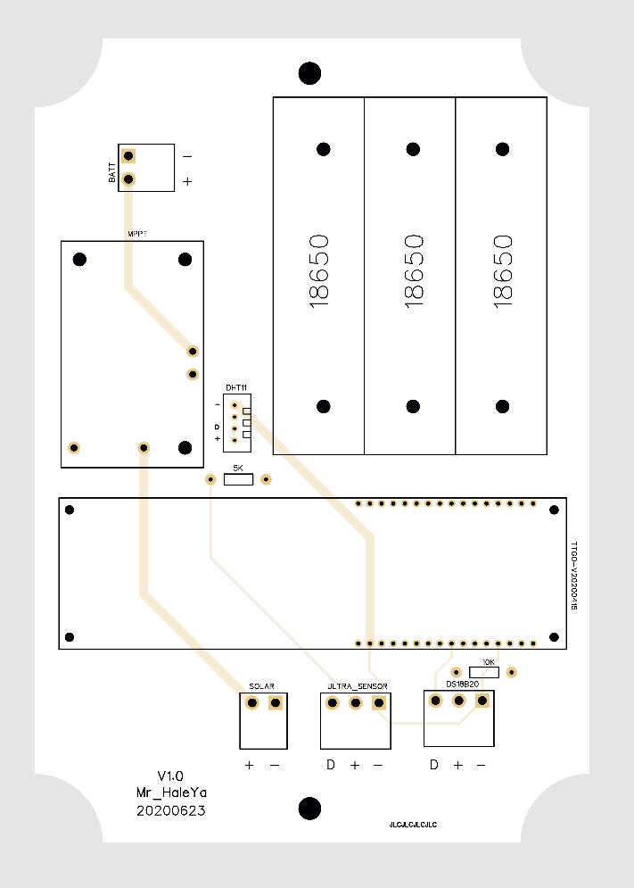  |  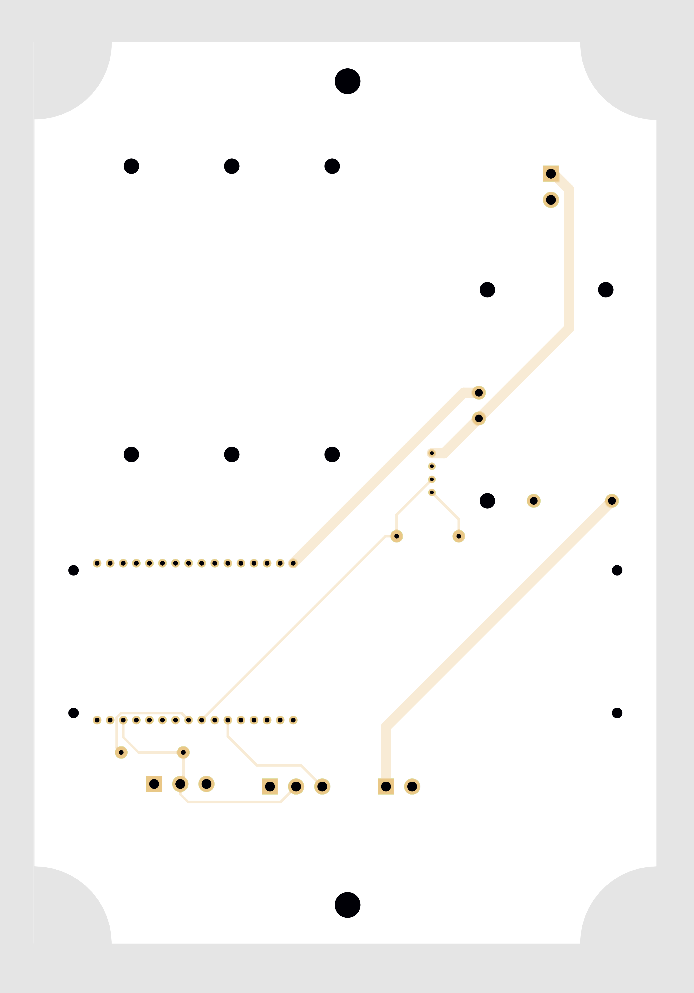
