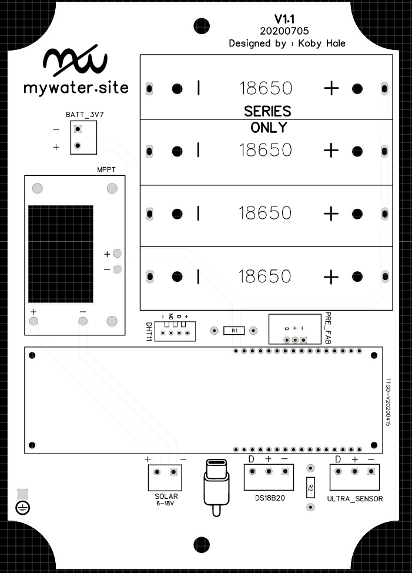
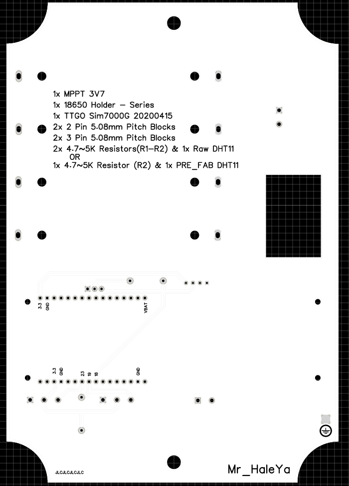
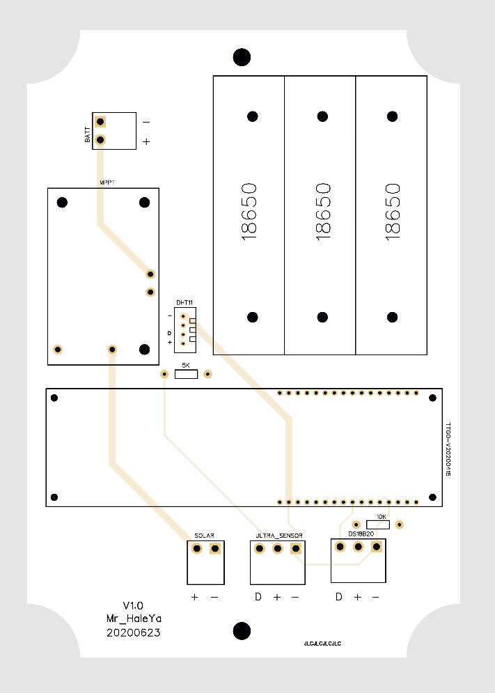

# My Water Site Misc

3D files [Notes](3D_models/README.md)

Planned additions
- live data in graphs so new data is shown as it comes into the database (update interval of 1 min)
- graphs 24/1week/1month with slider for changing the amount of data viewed on a graph
- alerts that users can set for email or text message 
- volume total for time selected (for example 24 hr would be all data points of volume added togeter to get total volume of that day)

# PCB

### V1.1

Front             |  Back
:-------------------------:|:-------------------------:
  |  

### V1.0

Front             |  Back
:-------------------------:|:-------------------------:
  |  
