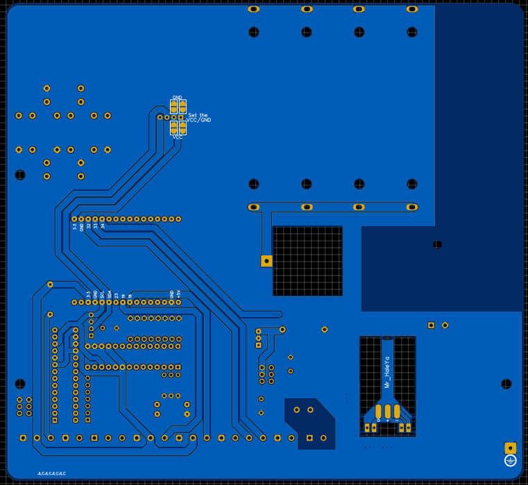

# My Water Site Misc

3D files [Notes](3D_models/README.md)

[Notes](#Notes)

Planned additions
- volume total for the time selected (for example 24 hr would be all data points of volume added together to get the total volume of that day)

# PCB

### [V3.2](https://github.com/Mr-HaleYa/MyWater_Misc/tree/master/PCB#v32)

Front             |  Back
:-------------------------:|:-------------------------:
  |  

### [V3.1](https://github.com/Mr-HaleYa/MyWater_Misc/tree/master/PCB#v31)

Front             |  Back
:-------------------------:|:-------------------------:
  |  

### [V3.0](https://github.com/Mr-HaleYa/MyWater_Misc/tree/master/PCB#v30)

Front             |  Back
:-------------------------:|:-------------------------:
  |  

### [V2.0](https://github.com/Mr-HaleYa/MyWater_Misc/tree/master/PCB#v20)

Front             |  Back
:-------------------------:|:-------------------------:
  |  

### [V1.2](https://github.com/Mr-HaleYa/MyWater_Misc/tree/master/PCB#v12)

Front             |  Back
:-------------------------:|:-------------------------:
  |  

### [V1.1](https://github.com/Mr-HaleYa/MyWater_Misc/tree/master/PCB#v11)

Front             |  Back
:-------------------------:|:-------------------------:
  |  

### [V1.0](https://github.com/Mr-HaleYa/MyWater_Misc/tree/master/PCB#v10)

Front             |  Back
:-------------------------:|:-------------------------:
  |  

### Notes

- Twilio SIM most commonly uses AT&T or TMOBILE CATM1 so >2 bars of service is wanted when surveying an area.

#### Sensors

MB7369 HRXL-MaxSonar-WRM - 30cm - 500cm range for $109.95

MB7368 HRXL-MaxSonar-WRML - 50cm to 1000cm range for $119.95

- The sensor __Must__ be installed at least 2 feet above the max water height to ensure proper readings. the range of the current sensor is 30cm to 500cm (~1FT - 16FT)

- #### MPPT
  - Red - charging
  - Green - full
  - Flashing - Battery disconnected / error
