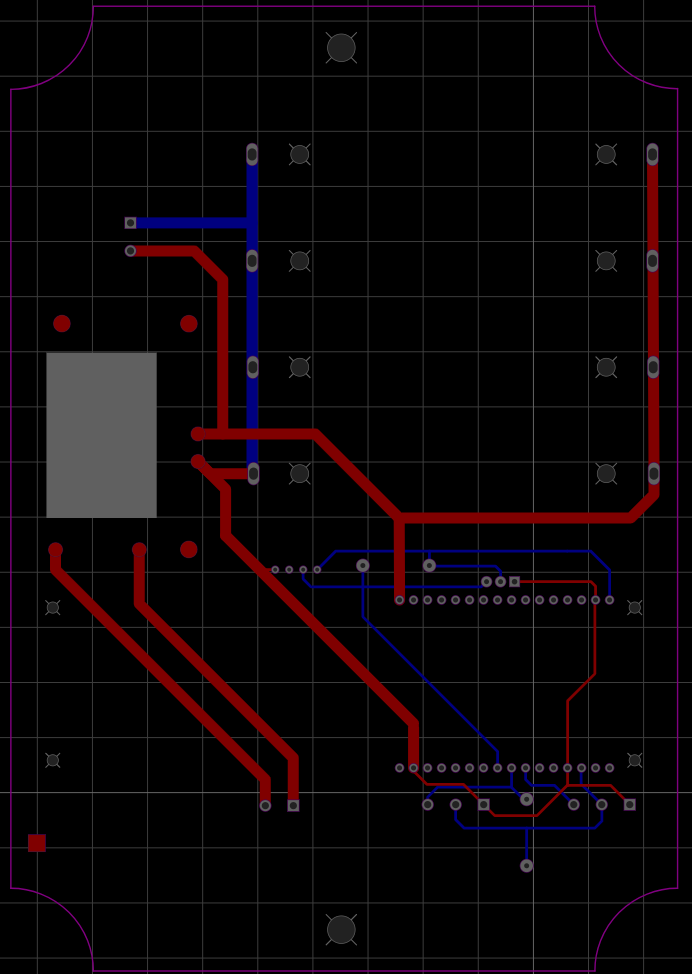

# mywatersitemisc

literally is just for all the bugs or issues we have as well as some 3d print parts

Planned additions
- live data in graphs so new data is shown as it comes into the database (update interval of 1 min)
- graphs unit conversion (depth = mm in ft m  & flow = cfs gps mps )
- graphs 24/1week/1month with slider for changing the amount of data viewed on a graph
- alerts that users can set for email or text message 
- volume total for time selected (for example 24 hr would be all data points of volume added togeter to get total volume of that day)

# PCB

### V1.0

Front             |  Back
:-------------------------:|:-------------------------:
  |  

